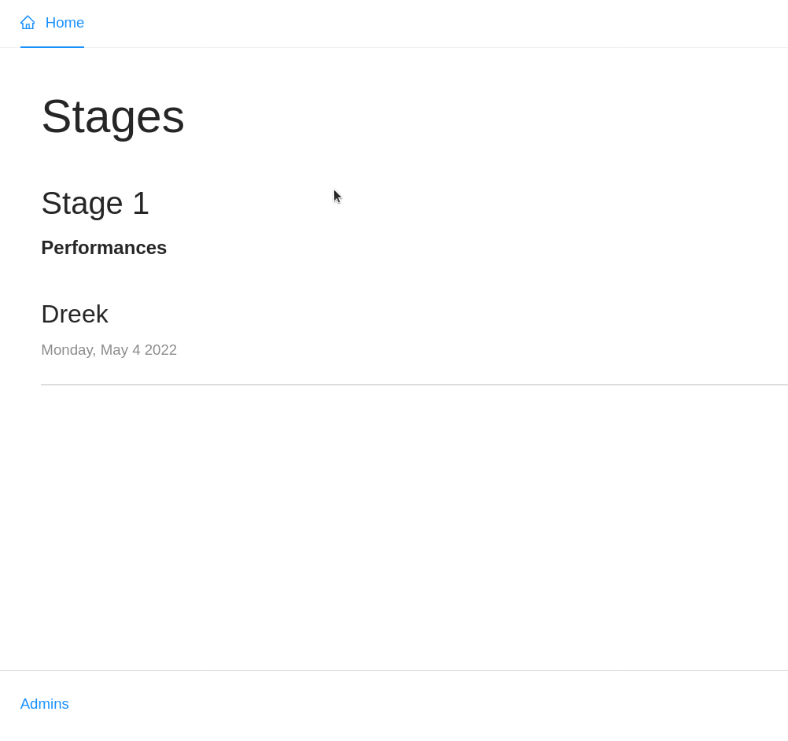

# AWS Serverless GraphQL API Functions, Full Typescript and Node SDK V3

This project will deal with a GraphQL API, created from a basic [Schema](amplify/backend/api/festivalapp/schema.graphql)  
its a more advanced that the single Entity/Model from previos project: [AWS Amplify GraphQL CRUD](https://github.com/renato1010/aws-amplify-graphql-crud).

Here we relate two Entities/Models Stage and Performance, start stablishing a more sophisticated Authorization scheme  
using for that a **GraphQL Transform/Directive: @auth** something like that:

```graphql
type Stage
  @model
  @auth(rules: [{ allow: public, operations: [read] }, { allow: groups, groups: ["Admin"] }]) {
  id: ID!
  name: String!
  performances: [Performance] @connection(keyName: "byStageId", fields: ["id"])
}
```

Those rules mean: that for **Stage** to list/read the resource the user will need an **API KEY** and for the rest of operations
the user will need to belong to an specific group in a Cognito User Pool, this case "Admin" group. The process of adding a user to
a group is handled by our [Auth function: add-to-groups](amplify/backend/function/festivalappda5784bdPostConfirmation/src/add-to-group.ts)  
at the end the second rule means: Update, Delete only for "Admin" users.

Even more interesting is the way to inter-relate the two Models (Stage/Performance), the second Model(Performance)

```graphql
type Performance
  @model
  @key(name: "byStageId", fields: ["performanceStageId"])
  @auth(rules: [{ allow: public, operations: [read] }, { allow: groups, groups: ["Admin"] }]) {
  id: ID!
  performanceStageId: ID!
  productID: ID
  performer: String!
  imageUrl: String
  description: String!
  time: String
  stage: Stage @connection
}
```

is related to Stage like this:

1. **Stage** resolver uses stage ID to retrieve info from Stage table in database.
2. Field **performances** on Stage type object will have their own resolver, and will use stage ID to retrieve  
   related _performances_ by querying the database using the secondary index created by **@key** directive

**GraphQL Transform: @connection:** part of [GraphQL Transform library](https://docs.amplify.aws/lib/graphqlapi/getting-started/q/platform/js#updating-your-graphql-schema) these directive allow you to "decorate" your Schema  
and pull additional functionality
@connection stablish relationships between Stage and Peformance  
and generates the necessary resolvers(Will require a little tweak)  
**@connection:** Makes really simple to configure custom index structures(at DynamoDB tables) for @model types.  
in our case will set _stage ID_ as secondary key on the _performance_ table. And will be able to request **stages**  
and their corresponding **performances** in a single GraphQL query.

## Credits

This example and code is based on book **Full Stack Serverless** by [Nader Dabit](https://twitter.com/dabit3)  
I changed the project a bit using `Typescript` insted of `JavaScript` on code examples, and other minor changes  
You can check the original code [here](https://github.com/dabit3/full-stack-serverless-code/tree/master/appsync-in-depth). If you want to run the code you'll need to install Amplify and get your own  
`src/aws-exports.js` file that you will need to configure the project  
If have no prior exp with **Amplify** watch this [video](https://youtu.be/fWbM5DLh25U) to learn how to configure the Amplify CLI

## convert JS code into Typescript

It is almost the same as in this project: [JS to TS](https://github.com/renato1010/full-serverless-full-typescript#typescript-lambda-functions-backend)

\*\* After all code changes in backend don't forget to deploy the backend

```bash
  amplify push
```

## Frontend

Some issues I found when converting React components to Typescript

[At Home](src/Home.tsx): within the `useEffect` we run the getStages function to run the GraphQL Query  
to do that we use the **API(APIClass)** from 'aws-amplify', but you need to pass an options object and for
the `authMode` typescript expects an `Enum` typescript type, so will complait if yu pass string 'API_KEY'
so to fix that you need to pass the `GRAPHQL_AUTH_MODE` enum imported from '@aws-amplify/api-graphql/lib-esm'
The response from the Query is Generic type passing a self made object type(easier way I found)

```typescript
import { GRAPHQL_AUTH_MODE, GraphQLResult } from '@aws-amplify/api-graphql/lib-esm';

async function getStages(): Promise<void> {
  const apiData = (await API.graphql({
    query: listStages,
    authMode: GRAPHQL_AUTH_MODE.API_KEY,
  })) as GraphQLResult<{ listStages: { items: Stage[] } }>;
  const { data } = apiData;
  setLoading(false);
  setStages(data?.listStages?.items ?? []);
}
```

Finally run the App:

```bash
  npm run start
```


